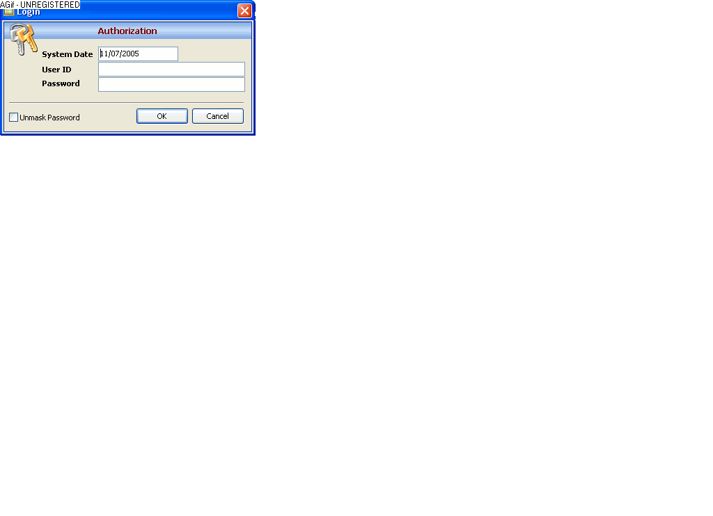

## Patient System

### Description

A simple Application with a taste of commercial UI.No commercial components. All came from the open source community mainly PSC.

Read about me for the credits. Best viewed on Win XP. Tested With Win XP SP2.

In order to run you need to download and compile the following

Phantom Panel http://www.Planet-Source-Code.com/vb/scripts/ShowCode.asp?txtCodeId=61638&amp;lngWId=1

and XTab Control http://www.Planet-Source-Code.com/vb/scripts/ShowCode.asp?txtCodeId=56462&amp;lngWId=1

Constructive critcisms and suggestions are welcome. Mabuhay!
 
### More Info
 

             |
---                |---
**Submitted On**   |2005-11-07 15:48:52
**By**             |[Ù­mega](https://github.com/Planet-Source-Code/PSCIndex/blob/master/ByAuthor/mega.md)
**Level**          |Intermediate
**User Rating**    |5.0 (60 globes from 12 users)
**Compatibility**  |VB 3\.0, VB 4\.0 \(16\-bit\), VB 4\.0 \(32\-bit\), VB 5\.0, VB 6\.0, VB Script, ASP \(Active Server Pages\) , VBA MS Access, VBA MS Excel
**Category**       |[Complete Applications](https://github.com/Planet-Source-Code/PSCIndex/blob/master/ByCategory/complete-applications__1-27.md)
**World**          |[Visual Basic](https://github.com/Planet-Source-Code/PSCIndex/blob/master/ByWorld/visual-basic.md)
**Archive File**   |[Patient\_Sy1946681172005\.zip](https://github.com/Planet-Source-Code/mega-patient-system__1-63186/archive/master.zip)

